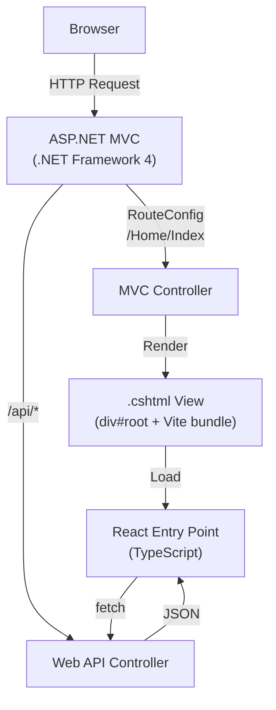
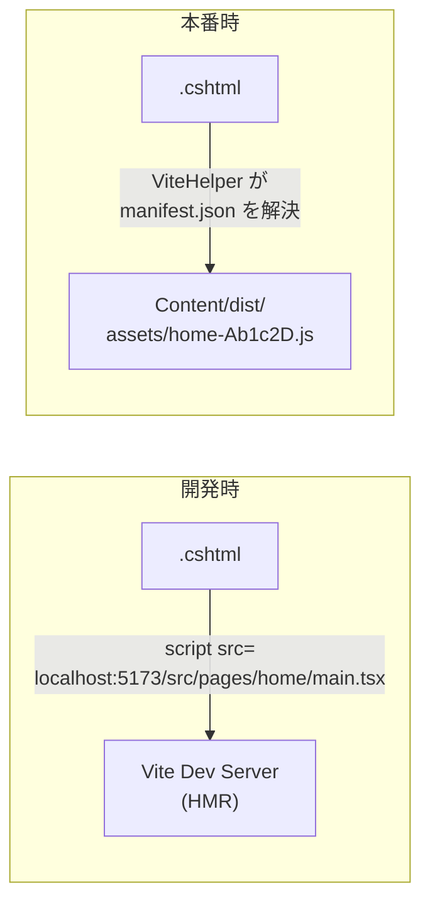

# ASP.NET MVC + React MPA アーキテクチャ

## 全体構成

ASP.NET MVC がルーティングとAPI提供を担い、各Controller/Actionに対応するRazorビューがReactアプリのホストとなるMPA (Multi-Page Application) 構成。



## ディレクトリ構成

```
asp-dotnet-mvc-react/
├── MyApp.sln
├── MyApp/                              # ASP.NET MVC プロジェクト
│   ├── MyApp.csproj
│   ├── Web.config
│   ├── Global.asax / Global.asax.cs
│   ├── App_Start/
│   │   ├── RouteConfig.cs              # MVC ルーティング
│   │   └── WebApiConfig.cs             # Web API ルーティング (/api)
│   ├── Controllers/
│   │   ├── HomeController.cs           # → Views/Home/Index.cshtml
│   │   ├── UserController.cs           # → Views/User/Index.cshtml
│   │   └── Api/
│   │       └── HomeApiController.cs    # JSON API
│   ├── Models/
│   ├── Views/
│   │   ├── Shared/
│   │   │   └── _Layout.cshtml          # 共通レイアウト
│   │   ├── Home/
│   │   │   └── Index.cshtml            # React マウントポイント
│   │   └── User/
│   │       └── Index.cshtml
│   ├── Helpers/
│   │   └── ViteHelper.cs               # Vite manifest 読み込みヘルパー
│   └── Content/
│       └── dist/                       # Vite ビルド出力先
│
├── frontend/                           # フロントエンド (React + TS)
│   ├── package.json
│   ├── pnpm-lock.yaml
│   ├── tsconfig.json
│   ├── vite.config.ts
│   └── src/
│       ├── pages/                      # 各ページのエントリポイント
│       │   ├── home/
│       │   │   ├── main.tsx            # Vite entry
│       │   │   └── App.tsx
│       │   └── user/
│       │       ├── main.tsx
│       │       └── App.tsx
│       ├── components/                 # 共有コンポーネント
│       ├── hooks/                      # 共有フック
│       ├── utils/                      # ユーティリティ
│       └── types/                      # 型定義
│
├── docs/
│   └── architecture.md                 # 本ドキュメント
└── .gitignore
```

## 技術スタック詳細

### サーバーサイド

- **ASP.NET MVC 5** (.NET Framework 4.x)
- **Web API 2** (同一プロジェクト内、`/api/` プレフィックス)
- IIS Express (開発) / IIS (本番)

### フロントエンド

- **React 19** + **TypeScript 5.x**
- **Vite 6.x** (MPA マルチエントリ構成)
- **pnpm** (パッケージマネージャ)

### Linter / Formatter (候補 - 後日決定)

| ツール                   | 特徴                                                |
| ------------------------ | --------------------------------------------------- |
| **Biome**                | Lint + Format を1ツールで。高速、設定シンプル       |
| **ESLint v9 + Prettier** | 定番。プラグイン豊富で柔軟                          |
| **oxlint + Prettier**    | 超高速Lint + 定番Format。ルールカバレッジは発展途上 |

## Vite MPA マルチエントリ構成

`frontend/vite.config.ts` で各ページをエントリポイントとして指定:

```typescript
import { defineConfig } from "vite";
import react from "@vitejs/plugin-react";
import { resolve } from "path";

export default defineConfig({
  plugins: [react()],
  build: {
    outDir: "../MyApp/Content/dist",
    emptyOutDir: true,
    manifest: true,
    rollupOptions: {
      input: {
        home: resolve(__dirname, "src/pages/home/main.tsx"),
        user: resolve(__dirname, "src/pages/user/main.tsx"),
      },
    },
  },
  server: {
    origin: "http://localhost:5173",
  },
});
```

## 開発/本番 のアセット読み込み

### 仕組み

Razor ビューから Vite のアセットを読み込む `ViteHelper` を作成する。

- **開発時**: Vite dev server (`http://localhost:5173`) の URL を直接参照。HMR が有効。
- **本番時**: `Content/dist/.vite/manifest.json` を読み、ハッシュ付きファイル名を解決。



### Razor ビュー例 (`Views/Home/Index.cshtml`)

```html
@{
    ViewBag.Title = "Home";
    Layout = "~/Views/Shared/_Layout.cshtml";
}

<div id="root"></div>

@Html.Raw(ViteHelper.RenderScripts("home"))
```

### ViteHelper (C#) の責務

- `Web.config` の `AppSettings` で `ViteDevMode=true/false` を切り替え
- 開発時: `<script type="module" src="http://localhost:5173/@vite/client"></script>` + エントリスクリプト
- 本番時: `manifest.json` を読み、JS/CSS タグを生成

## API 設計

- MVC コントローラ: ページの HTML レンダリング (`/Home/Index`, `/User/Index`)
- Web API コントローラ: JSON データ提供 (`/api/home/data`, `/api/user/list`)
- 同一ドメイン内なので CORS 不要

```
GET /Home/Index          → HomeController.Index()    → Razor View (React host)
GET /api/home/dashboard  → HomeApiController.Get()   → JSON
POST /api/user/create    → UserApiController.Post()  → JSON
```

## 開発ワークフロー

1. Visual Studio / IIS Express で ASP.NET MVC を起動
2. `frontend/` で `pnpm dev` → Vite dev server (port 5173) 起動
3. ブラウザで ASP.NET MVC の URL にアクセス → Razor がVite dev serverからReactをロード
4. React コード変更 → HMR で即時反映

## 本番ビルド

1. `cd frontend && pnpm build` → `MyApp/Content/dist/` に出力
2. Visual Studio で ASP.NET MVC をビルド/デプロイ
3. `Content/dist/` も含めてデプロイ

## .gitignore への追加

```
# ASP.NET
MyApp/bin/
MyApp/obj/
MyApp/packages/
*.suo
*.user

# Vite build output
MyApp/Content/dist/

# Node
frontend/node_modules/
```
